# loggers_learning-

## Tips for Clean and Efficent Logging

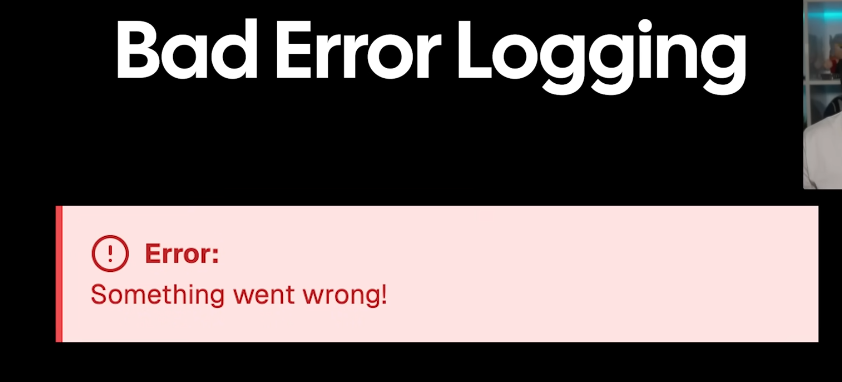
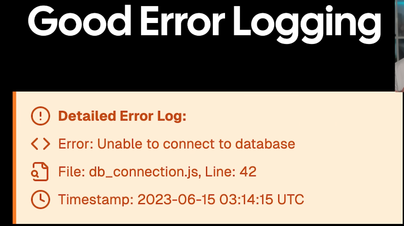
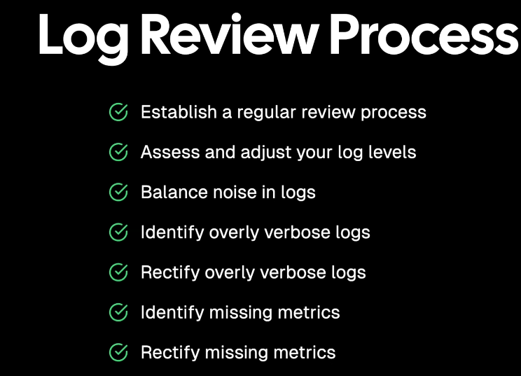
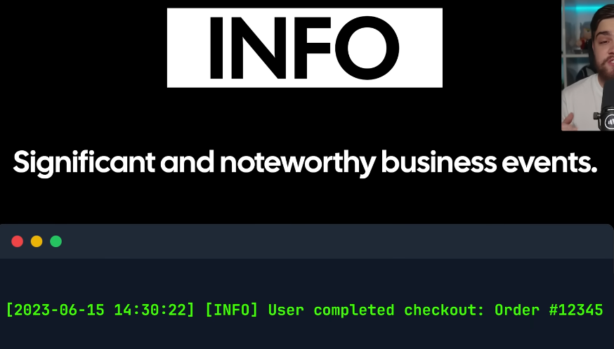
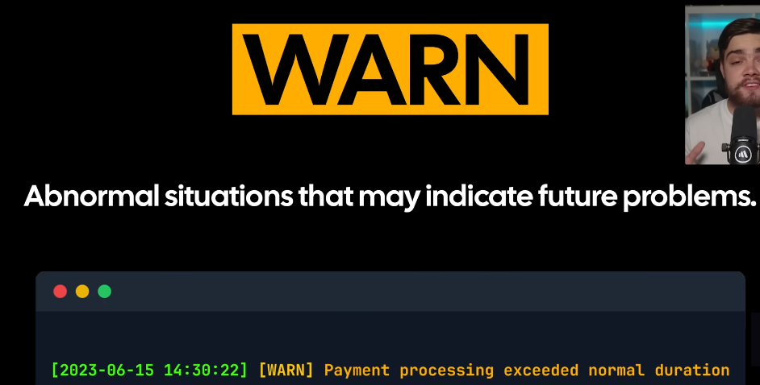

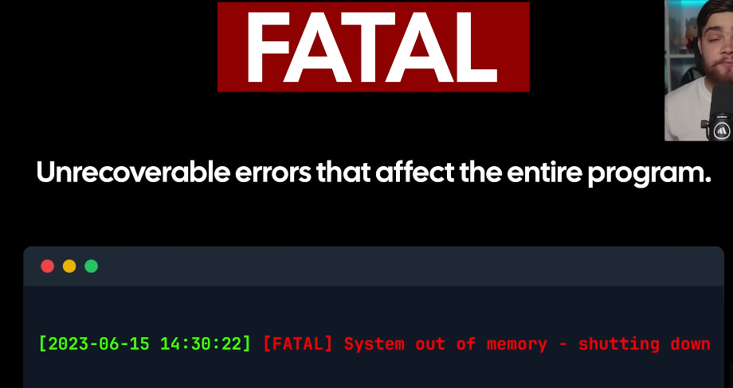

## Ease of knowing

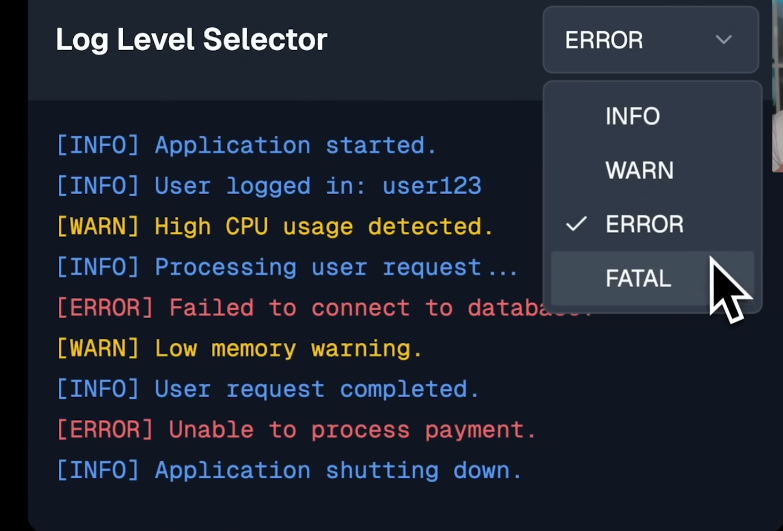

## Structure logging

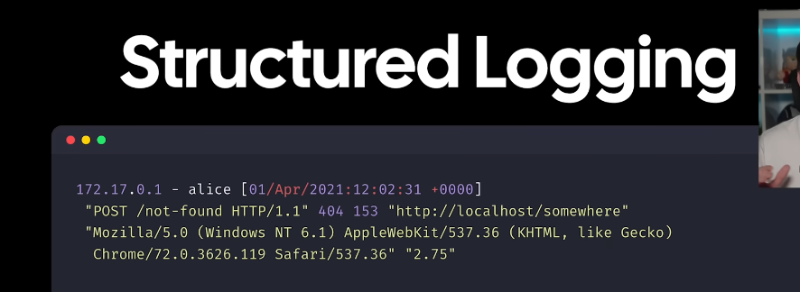
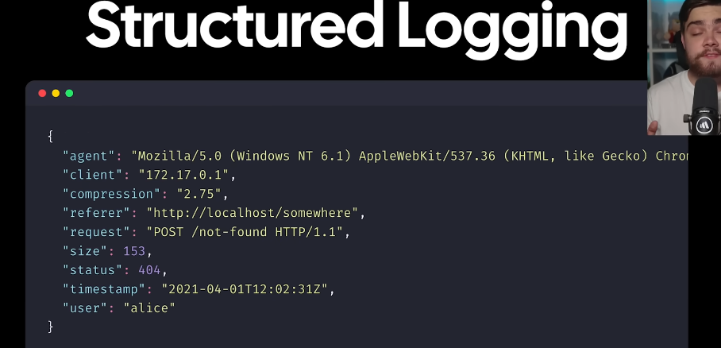

## Example of things to add in an log

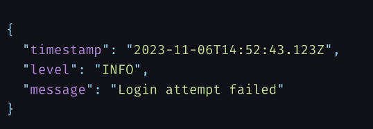
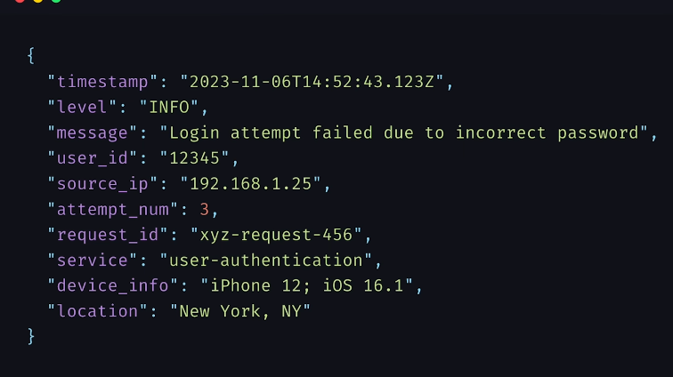

## List of this to capture in every Log Entree

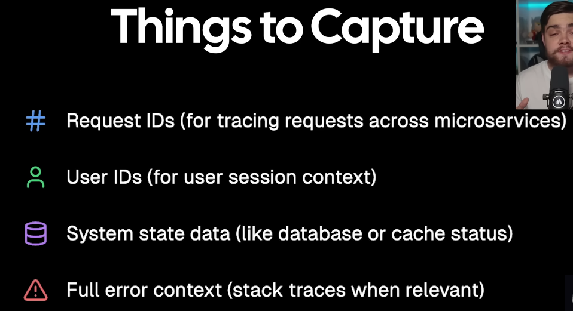

## Loggers are BlackBox Recoder of our system

- so just don't add what happend instead add what cause it or led it to it
- make it detaild enough to actually know what happend

## How to cut on space

### Sampleing

- Instead of saving every single logs we save a representative sample
- for example our auth logs everytime a user logs in, and with sampleing with 20% sampling rate we can just store 2 out of 10 logs
- may be keep all of your error logs and sample the success logs
- if having high trafic at specific end point sample more over there
  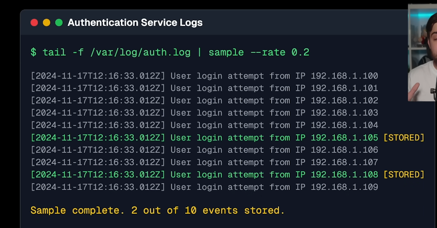

## Cononical log lines

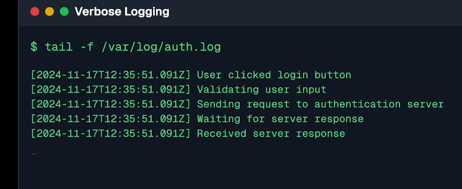

- instead
- cononical think of it as a movie summary instead of watching all the scence seprately
- for eaxmple, at the end of every requiest we can create one log entre that captures everything important, what the user tried to do, who they were, how long it took, what went wrong and eveen how much time we spend in the database
- instead of schrolling through hundrads of logs we get everything in one place

## Retention

- meaning how long to store the logs for
  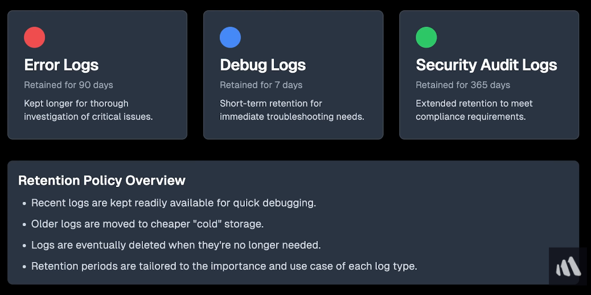

## Securing logs

- our log may contain sensitive information such as
  
- we can do so in 3 ways
  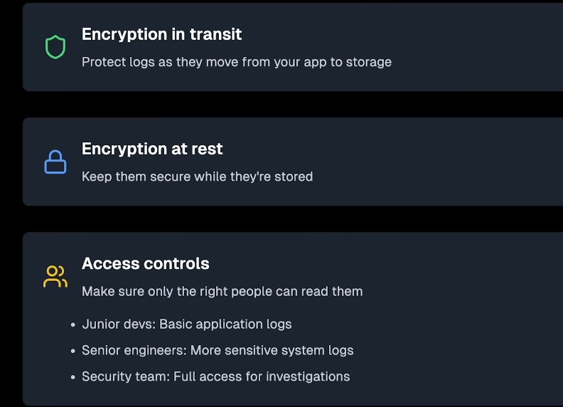

## what should not be in logs in the 1st place

what we don't what to log

instead
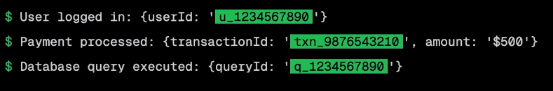

- we can use packages like "go slog"
  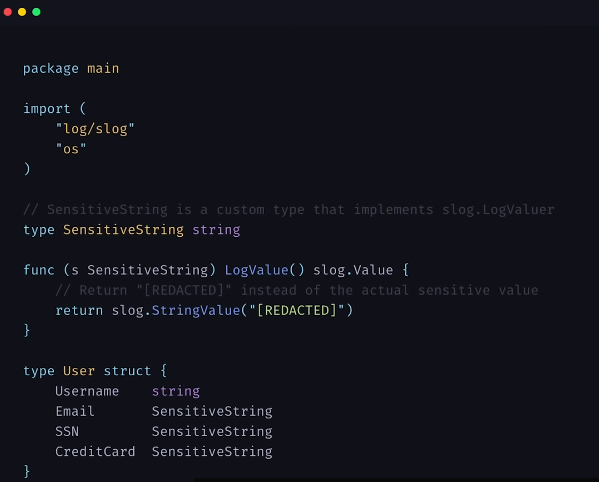
  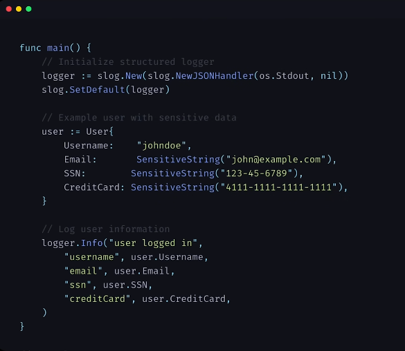
- even if someone accedently logs the entire user object this only shows the userId
  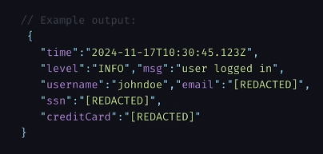
  for extra protection setup filters in your logging pipeline to catch and redact anything
  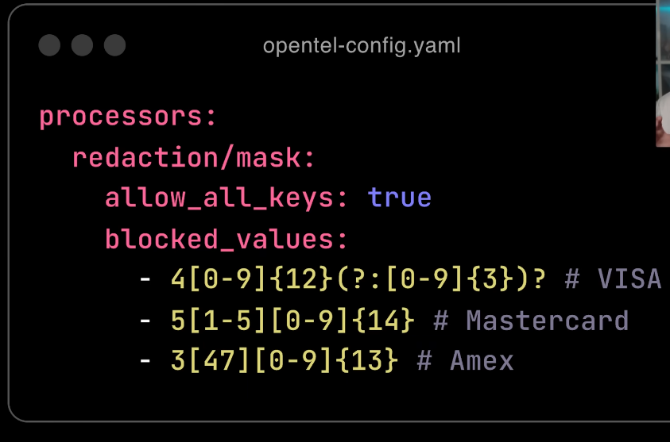
